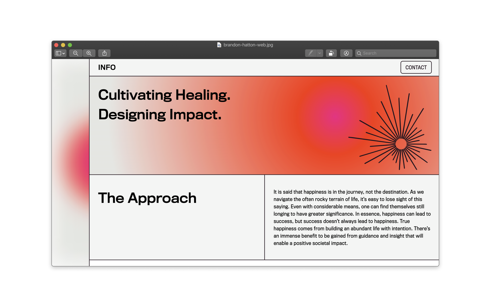
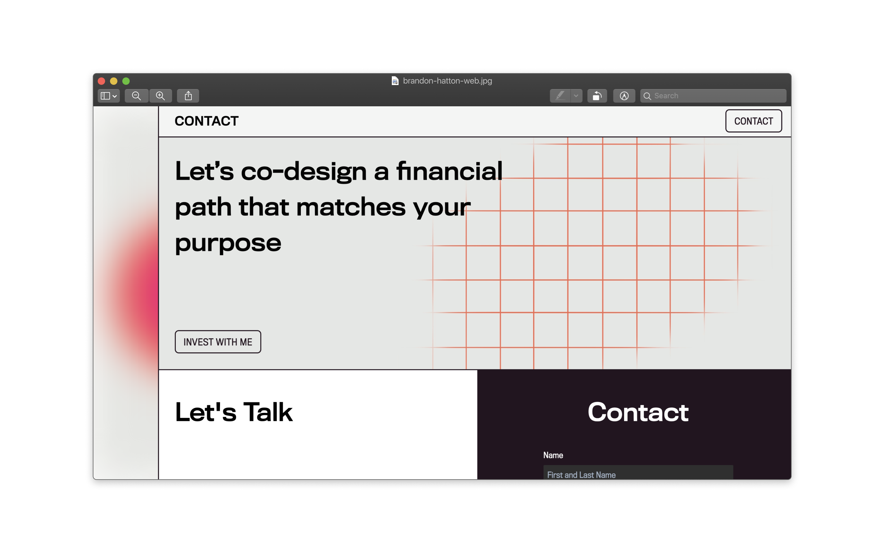

# Web Design and Development

Brandon Hatton is a financial consultant. His approach to helping people manage their wealth
is to get them to realize that philanthropic efforts are how you build a legacy and fulfilling life.

His approach to wealth and finance is disruptive in his industry so I approached his website in a similar fashion.
You can view the live website at [brandonhatton.com](https://brandonhatton.com/)

## Unconventional Layout for an Unconventional Approach to Finance

The design of his website is an unconventional navigation system that has a sliding content 
drawer. Typically if you were to have a layout like this it would be a single page
application but with Gatsby.js I was able to have all the pages be separate but with
an app like feel.

## Modular pages

To complement the content drawer I decided to give the pages a modular grid feel.

## Tools Used

* Figma for Wireframing and Design
* Gatsby.js for Static Site Generator
* GSAP for animation
