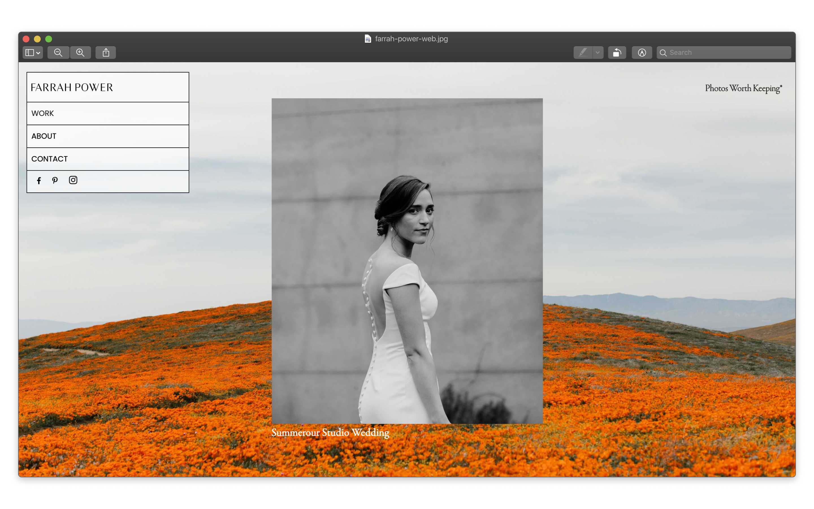
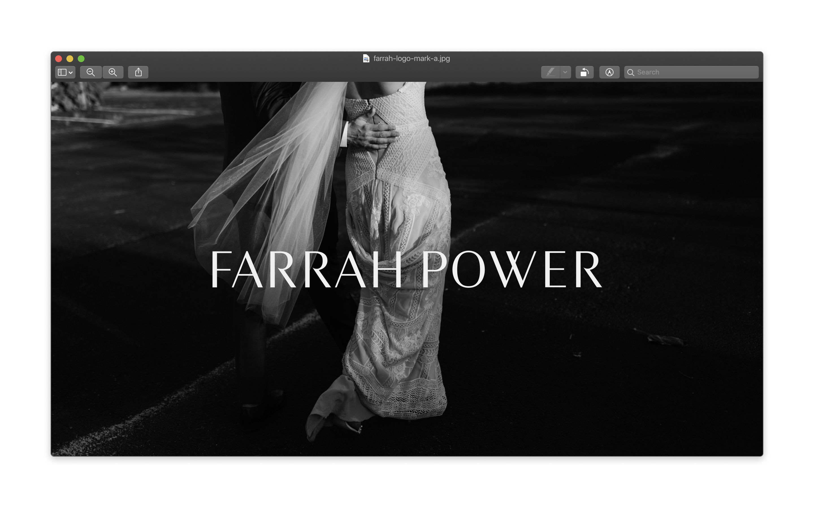

# Photographer Branding and Website

My wife needed a new website and branding that felt complemented 
the essence of her work. On the spectrum of timely and timeless she aims more towards the timeless end. She also has
to approach her branding differently because she works directly with customers when shooting weddings.

You can view the website at [farrahpower.com](https://farrahpower.com/)

## Longevity

The goal of her logo and branding was not to create the most trendy look right now but to come up with a logo that shows
her love of style, her taste, and her ability to create imagery that exists independently from time. I believe we landed
on a logo mark that is very modern but still feels familiar and nostalgic.

## Playing the Background

The other goal of the branding and her website was to build a strong brand but also allow plenty of room to let her work
speak for itself. We did this by creating specific areas for structured content and utilizing a modular navigation that gets 
out of the way as you scroll.

## Tools Used

* Illustrator for logo and branding
* Figma for wireframes and Design
* Gatsby.JS for Static Site Generator
* Shopify for print shop
* Narrative.so for photo blogging
