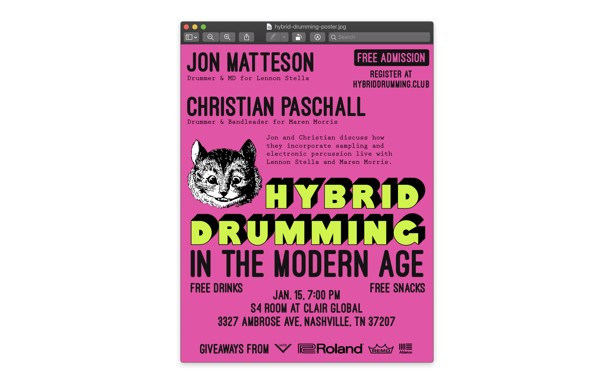
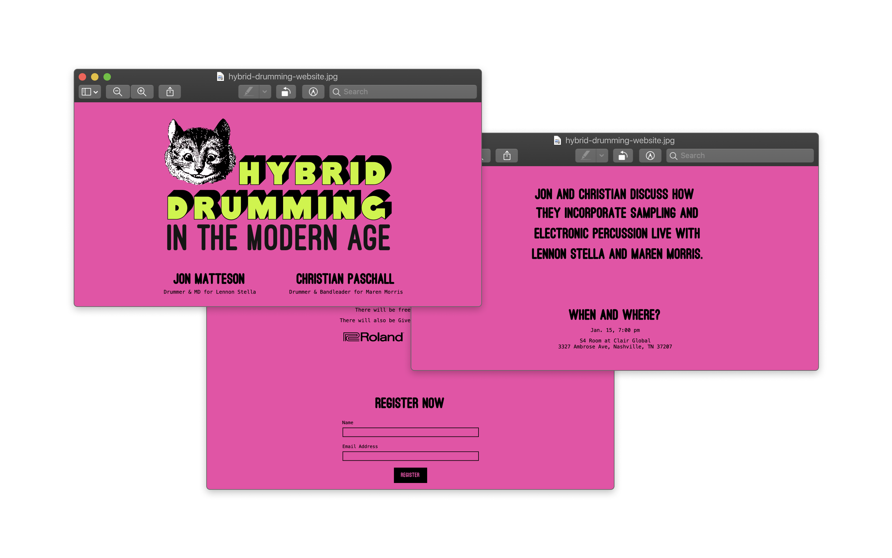

# Event Graphic and Landing Page

This was an event that my brother-in-law was putting together in Nashville. It started as a poster design and
they needed some way to handle registrations. From there I took the poster design and and put together a landing page for them.
Their event was free admission and they only needed a head count so I took the form submissions and had them add the registration
data to a Google Spreadsheet. You can still view the landing page [here](https://hybriddrumming.club/)

## Tools used
* Illustrator for poster design
* Gatsby.JS for the landing page
* Netlify for hosting and forms
* Google Sheets for registration data
