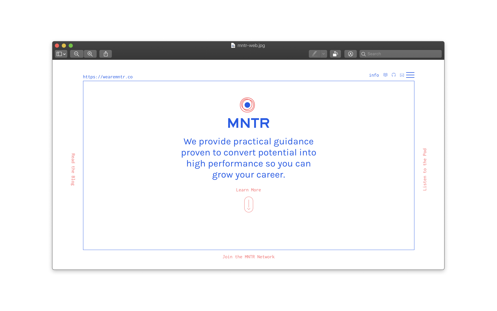
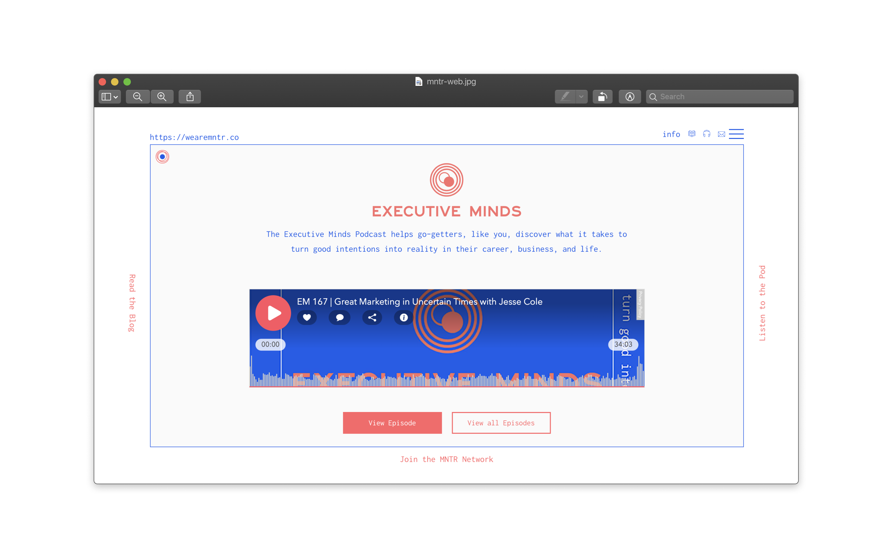
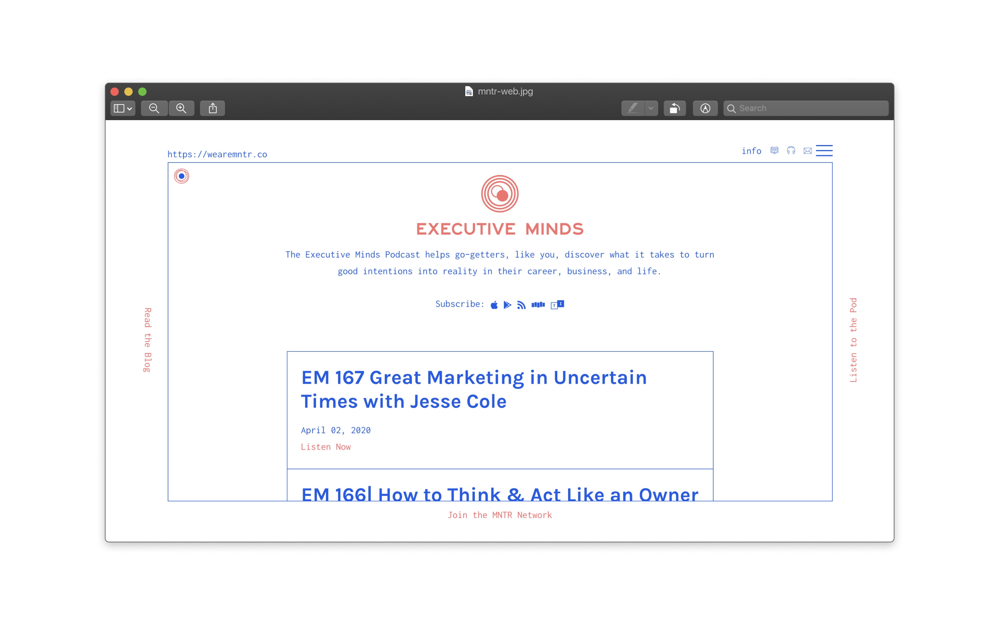
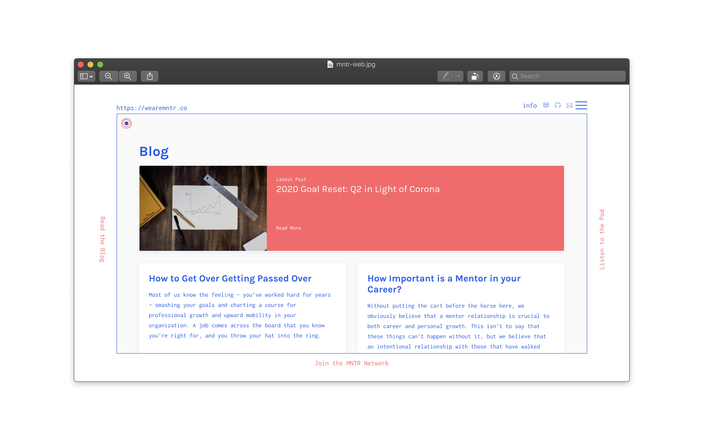
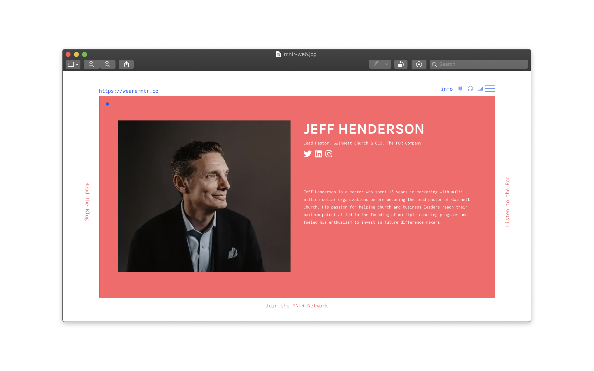

# Website Design and Development

MNTR is a group of business leaders and entrepreneurs that coach people and host a podcast. This 
was a rebrand through Oust. They needed a fresh take on what business coaching could look like.

## The Window

Without much photography there was plenty of room to experiment with making the website feel interesting. 
That lead me towards a more unconventional site container that feels almost like a window for content or a
portal into what MNTR is.

## Tools Used
* Figma for designing and prototyping
* Gatsby.JS for the Static Site Generator
* Netlify for hosting and forms
* NetlifyCMS as a GUI for all the Markdown Content
